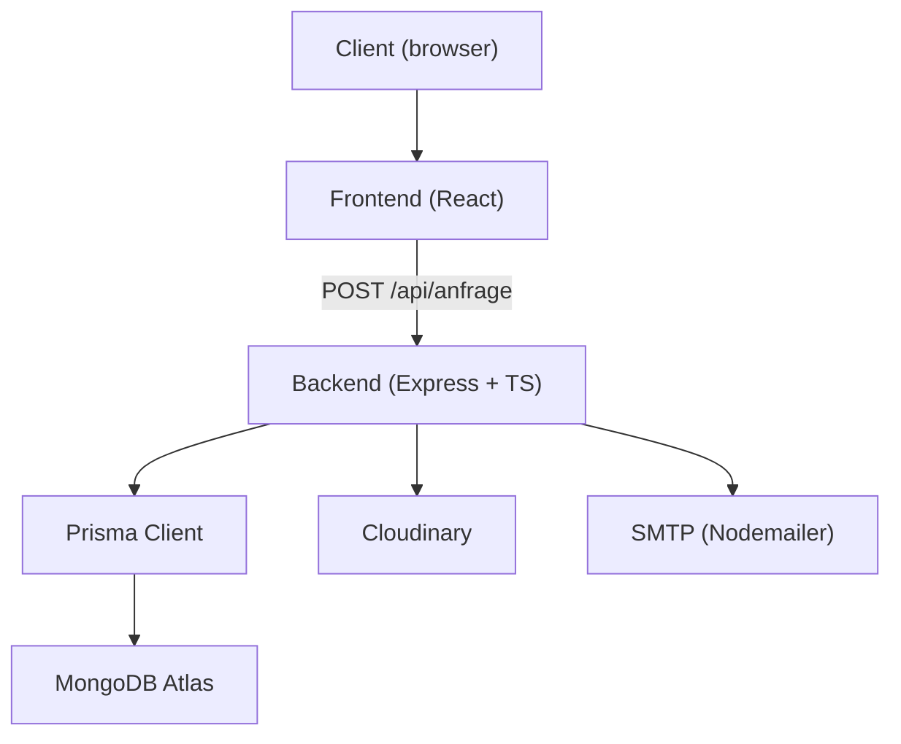
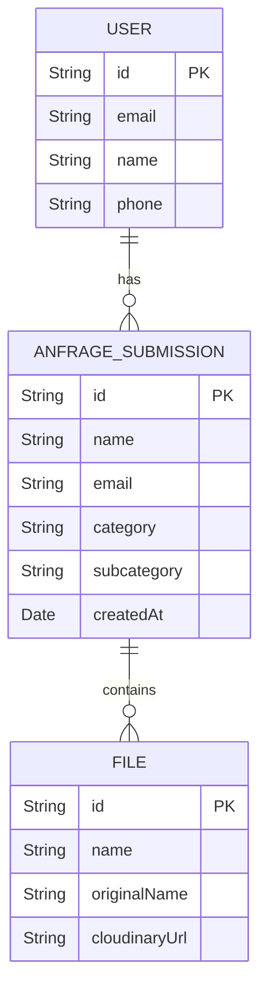
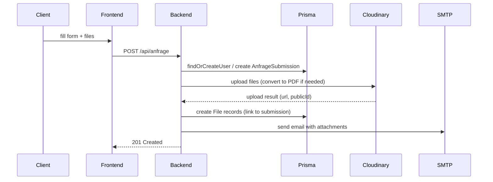
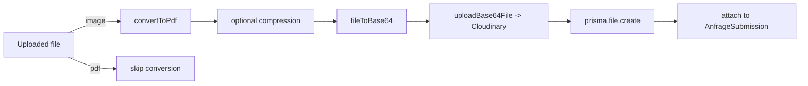

<h1 style="color:#0B66C3">Anfrage System Documentation</h1>

<hr />

<h2 style="color:#E65100">Project Overview</h2>
- Form system for credit/insurance requests. Users submit without login; advisors receive full request data.
- Stack: Node.js + Express + TypeScript, Prisma + MongoDB, Cloudinary, pdf-lib, Nodemailer.

---

<h2 style="color:#0B66C3">System Architecture (summary)</h2>
- Frontend (React) → Backend (Express) → Prisma → MongoDB Atlas  
- Backend handles: validation, deduplication, file conversion/upload, DB writes, email notifications.

---

<h2 style="color:#E65100">Diagrams</h2>

### 1) System architecture


### 2) ER diagram


### 3) Request sequence


### 4) File processing flow


---

<h2 style="color:#0B66C3">Data Models</h2>

User model:
```prisma
model User {
  id        String   @id @default(auto()) @map("_id") @db.ObjectId
  email     String   @unique
  name      String?
  phone     String?
  createdAt DateTime @default(now())
  submissions AnfrageSubmission[]
}
```

AnfrageSubmission model:
```prisma
model AnfrageSubmission {
  id          String   @id @default(auto()) @map("_id") @db.ObjectId
  name        String
  email       String
  phone       String?
  message     String
  unterlagen  String
  category    String
  subcategory String
  files       File[]
  createdAt   DateTime @default(now())
  user        User?    @relation(fields: [userId], references: [id])
  userId      String?  @db.ObjectId
}
```

File model:
```prisma
model File {
  id                 String   @id @default(auto()) @map("_id") @db.ObjectId
  name               String
  originalName       String?
  mimeType           String?
  size               Int?
  cloudinaryUrl      String?
  cloudinaryPublicId String?
  anfrage            AnfrageSubmission? @relation(fields: [anfrageId], references: [id])
  anfrageId          String?            @db.ObjectId
  @@map("files")
  @@index([anfrageId], map: "idx_file_anfrage")
  @@index([mimeType], map: "idx_file_mimeType")
}
```

---

<h2 style="color:#E65100">Main Endpoint</h2>

POST /api/anfrage — receives and processes new requests.

Request example:
```json
{
  "name": "Alex Motogna",
  "email": "alex@example.com",
  "phone": "06601759059",
  "message": "Requesting information",
  "category": "Kredit",
  "subcategory": "Auto",
  "uploadedFiles": [...]
}
```

Response example:
```json
{
  "id": "68c4718234d53dba7ecc1880",
  "name": "Alex Motogna",
  "email": "alex@example.com",
  "createdAt": "2025-09-12T19:16:17.661Z"
}
```

---

<h2 style="color:#0B66C3">Deduplication & User Profile</h2>
- Primary: exact email match (findOrCreateUser).  
- Secondary: phone + name heuristics for linking if email differs.  
- Behavior: upsert or link existing user and store submissions under user for future filtering/analytics.

---

<h2 style="color:#E65100">File Handling</h2>
- Supported: PDF (direct), JPEG/PNG (converted to PDF).  
- Limits: configurable (example max 10MB).  
- Steps:
  1. Validate file
  2. Convert images to PDF (pdf-lib)
  3. Upload base64 PDF to Cloudinary
  4. Create prisma.file record (cloudinaryUrl, publicId, anfrageId relation when valid)

---

<h2 style="color:#0B66C3">Email Template</h2>
```html
<h1>New Request</h1>
<p><strong>Name:</strong> ${name}</p>
<p><strong>Email:</strong> ${email}</p>
<p><strong>Phone:</strong> ${phone}</p>
<p><strong>Category:</strong> ${category}</p>
<p><strong>Subcategory:</strong> ${subcategory}</p>
<!-- list attachments if present -->
```

Env keys:
- SMTP_FROM, RECIPIENT_EMAIL, SMTP_HOST, SMTP_PORT

---

<h2 style="color:#E65100">Operational / Dev Commands</h2>
```bash
# install deps
npm install

# generate prisma client
npx prisma generate

# push schema (when DB reachable)
npx prisma db push

# dev
npm run dev